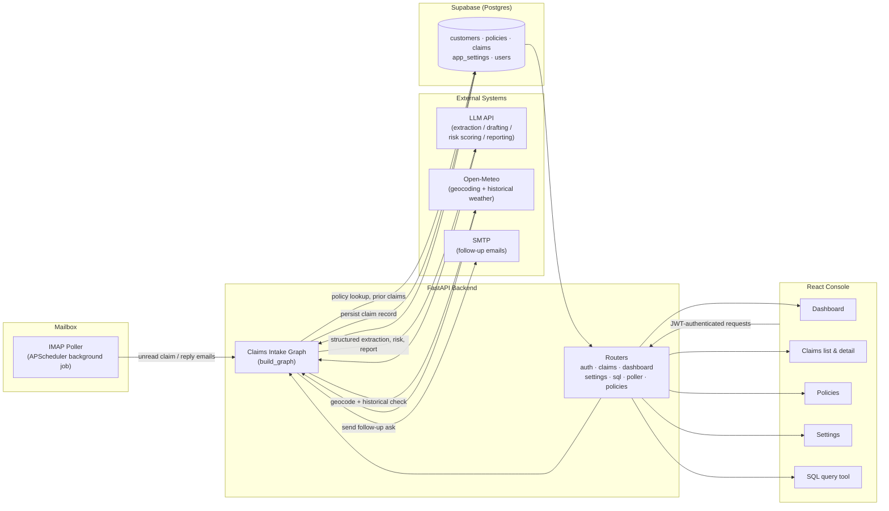
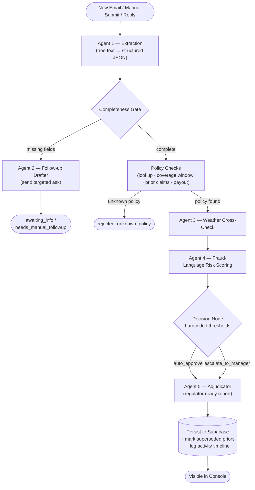
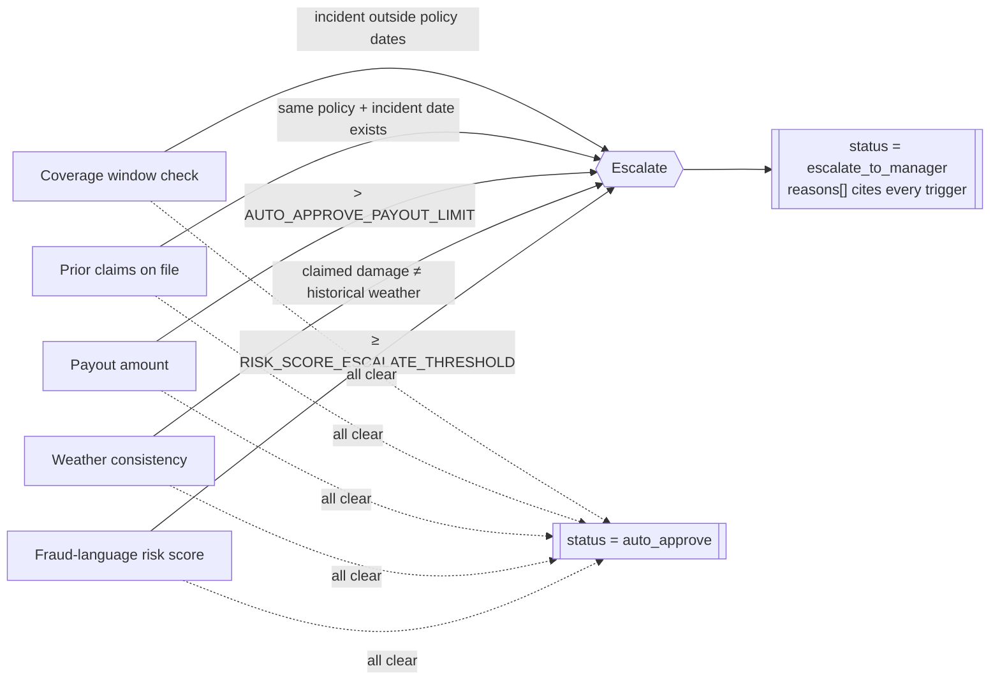
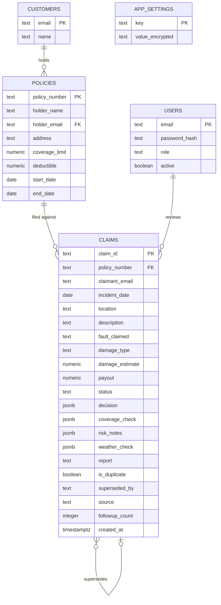

# FNOL Claims Intake

**A production multi-agent LangGraph pipeline for automated auto-insurance claim intake, triage, and adjudication — wrapped in a full-stack FastAPI + React operations console.**

[]()
[]()
[]()
[]()
[]()
[]()
[]()
[]()

🔗 **Live app:** [fnol-frontend.onrender.com](https://fnol-frontend.onrender.com)

---
## 🎥 **Demo video:**

https://github.com/user-attachments/assets/5a7c71fd-d49d-46ba-aaeb-d278c5af760a


---


## Overview

**FNOL** — *First Notice of Loss* — is the industry term for the moment a policyholder first reports an incident to their insurer. This project is a **production-grade, agentic FNOL intake system**: it watches a real mailbox, reads claim emails as they arrive, and runs each one through a graph of specialist agents that extract the facts, verify the policy, cross-check the weather, screen the language for fraud risk, and either auto-approve or escalate the claim to a human adjuster — with a full, regulator-ready report attached.

It started as a single production notebook and has since been rebuilt into a deployable application:

- **FastAPI backend** with JWT auth (admin / manager / checker roles), Supabase (Postgres) persistence, IMAP polling control, and a read-only SQL query tool.
- **React frontend** (manager + checker console): dashboard, claims list & detail, manual claim submission, policy management, inbox poller controls, a SQL query page, and a Settings page for API keys / SMTP / IMAP — editable at runtime, no redeploy needed.
- **Docker** for both services, running via `docker-compose` locally or on **Render** in production.

There is no mock mode. Every node talks to a live system (LLM API, Supabase, IMAP/SMTP, Open-Meteo).

| Piece | Backing system |
|---|---|
| LLM calls (extraction, drafting, risk scoring, reporting) | Live OpenAI-compatible endpoint (default: Gemini 2.0 Flash) |
| Claim / policy / customer storage | Supabase (Postgres) |
| Inbound claim emails | Real IMAP mailbox (unread-message polling) |
| Outbound follow-up emails | Real SMTP send |
| Weather corroboration | Open-Meteo geocoding + historical archive API |
| Auth / roles | JWT, admin / manager / checker |
| Ops UI | React console (dashboard, claims, policies, poller, SQL tool, users) |

---

## Table of Contents

1. [Architecture](#architecture)
2. [Agent Roster](#agent-roster)
3. [Claim Lifecycle](#claim-lifecycle)
4. [Decision Logic](#decision-logic)
5. [Data Model](#data-model)
6. [Feature List](#feature-list)
7. [One-Time Setup](#one-time-setup)
8. [Run Locally with Docker Compose](#run-locally-with-docker-compose)
9. [Run Locally Without Docker](#run-locally-without-docker-dev-mode)
10. [Deploy to Render](#deploy-to-render)
11. [Project Structure](#project-structure)
12. [Duplicate & Supersession Handling](#duplicate--supersession-handling)
13. [Reliability & Failure Handling](#reliability--failure-handling)
14. [Security Notes](#security-notes)

---

## Architecture

The system is a closed loop: an IMAP poller feeds raw emails into a compiled LangGraph state machine, which fans out to external services (LLM, Supabase, Open-Meteo, SMTP) and writes its final, structured decision back to Postgres. The FastAPI backend exposes that same graph over a REST API, and the React console consumes it for manual claims, review, and dashboards.



---

## Agent Roster

The graph is composed of five LLM-backed agents and three deterministic (hardcoded, non-AI) nodes, defined in `backend/app/graph/nodes.py`. Keeping policy math, coverage windows, and approval thresholds **out of the LLM's hands** is a deliberate design choice — those decisions must be auditable and reproducible.

| # | Node | Type | Responsibility |
|---|---|---|---|
| 1 | `extraction_agent` | 🤖 LLM | Parses the raw claim email into structured JSON: policy number, incident date, location, description, fault claimed, damage type. |
| — | `completeness_gate` | ⚙️ Deterministic | Checks the extracted claim against required fields; routes to follow-up if anything is missing. |
| 2 | `followup_agent` | 🤖 LLM | Drafts and sends a targeted "please send more details" email. Bails out to `needs_manual_followup` after `MAX_FOLLOWUP_ATTEMPTS`. |
| — | `policy_checks_node` | ⚙️ Deterministic | Looks up the policy in Supabase, checks the coverage window, searches for prior claims on the same policy + incident date, calculates payout. |
| 3 | `weather_agent` | 🤖 Tool-calling | Geocodes the claimed location and cross-checks the claimed damage type against real historical weather for that date. |
| 4 | `risk_language_agent` | 🤖 LLM | Scores the claim narrative (0.0–1.0) for suspicious phrasing or internal inconsistency, without accusing anyone of fraud outright. |
| — | `decision_node` | ⚙️ Deterministic | Combines every specialist's output against hardcoded thresholds to reach `auto_approve` or `escalate_to_manager`. |
| 5 | `adjudicator_agent` | 🤖 LLM | Writes the final regulator-ready report summarizing every check performed, its data source, and the decision rationale. |

---

## Claim Lifecycle

Every claim moves through the same compiled graph, whether it arrives by email or is submitted manually from the **New Claim** page. There are two exit ramps: **incomplete claims** stop for a human-facing follow-up email, and **claims tied to an unknown policy** are rejected outright. Everything else runs the full specialist gauntlet before reaching a decision.



---

## Decision Logic

`decision_node` is intentionally **hardcoded and deterministic** — it reads every specialist's output but never calls an LLM itself, so the approve/escalate call is always reproducible and auditable. A claim is escalated to a human the moment **any one** of these conditions is true:



If a claim escalates, **every** triggering reason is recorded in `decision.reasons` — not just the first one hit — so a reviewer in the console sees the complete picture in one read.

---

## Data Model

The claims pipeline runs on the same core tables as the original notebook, extended with the app's own auth and settings tables. Everything lives in Supabase / Postgres — there is no in-memory fallback.



Run `backend/app/schema.sql` once via **Supabase → Project → SQL Editor → New query**, or let the backend apply it automatically on first boot if `DATABASE_URL` is set.

---

## Feature List

- **Multi-agent pipeline**: identical logic to the original notebook (extraction, completeness gate, automated follow-up emails with a retry cap, policy lookup, coverage-window check, duplicate/prior-claim detection, weather cross-check via Open-Meteo, LLM fraud-language risk scoring, hardcoded decision thresholds, LLM-written adjudicator report).
- **Runtime-editable Settings page**: enter your own Google/LLM API key, SMTP credentials, and IMAP credentials from the UI. Anything left blank falls back to the backend's `.env` values automatically — no code changes or redeploys needed either way. Secrets are encrypted at rest.
- **Manager dashboard**: three buckets (waiting on customer / escalated to you / auto-approved) plus charts (claims by status, by damage type, total approved payout, duplicate count).
- **Claims list & detail**: search/filter, full automated-check breakdown (coverage window, weather match, risk score), decision reasons, adjudicator report, per-claim activity timeline (every agent step is logged), email log, manual review actions (approve / reject / request info / escalate / note), inline field editing, and a "resume with reply" box to manually feed in a follow-up email and re-run the pipeline.
- **New claim** page: paste any free-text claim report and it runs through the same extraction pipeline as an inbound email.
- **Policies** page: onboard/edit policyholder records (coverage limit, deductible, active window) that the pipeline checks claims against.
- **Inbox poller**: start/stop background IMAP polling, trigger a poll immediately, see run history. Runs entirely server-side (APScheduler), so it keeps working even with the browser closed.
- **Query database** page: a locked-down SQL editor (SELECT / WITH only — everything else is rejected before it reaches Postgres) with example queries, a table browser, and CSV export.
- **Users** page (admin only): create manager/checker/admin accounts, change roles, activate/deactivate.

---

## One-Time Setup

### Supabase project

1. Create a project at [supabase.com](https://supabase.com).
2. Go to **Project Settings → API** and copy the **Project URL** and the **service_role key** (not the anon key — the backend needs to bypass row-level security to do its job).
3. Go to **Project Settings → Database → Connection string → URI** and copy it. This becomes `DATABASE_URL` and powers the SQL query tool and automatic schema setup.
4. Either let the backend apply the schema automatically on first boot (it will, if `DATABASE_URL` is set), or run `backend/app/schema.sql` yourself once in the Supabase SQL editor.

### Backend environment

```bash
cp backend/.env.example backend/.env
```

Fill in `SUPABASE_URL`, `SUPABASE_KEY`, `DATABASE_URL`, a `JWT_SECRET`, an `ADMIN_EMAIL` / `ADMIN_PASSWORD` (the bootstrap manager account — change the password after first login), and a `SETTINGS_ENCRYPTION_KEY` (generate with `python -c "from cryptography.fernet import Fernet; print(Fernet.generate_key().decode())"`).

Everything else in `.env.example` (LLM/Google API key, SMTP, IMAP, thresholds) is **optional** — leave it blank and configure it later from the Settings page in the app, or fill it in now as a fallback. Either way works; whichever is set in the UI always wins.

---

## Run Locally with Docker Compose

```bash
docker compose up --build
```

- Backend: http://localhost:8000 (docs at `/docs`)
- Frontend: http://localhost:8080

Log in with `ADMIN_EMAIL` / `ADMIN_PASSWORD` from `backend/.env`, then create manager/checker accounts under **Users**, and enter your API keys under **Settings** if you didn't put them in `.env`.

---

## Run Locally Without Docker (dev mode)

```bash
# backend
cd backend
python -m venv venv && source venv/bin/activate
pip install -r requirements.txt
uvicorn app.main:app --reload

# frontend (separate terminal)
cd frontend
cp .env.example .env   # VITE_API_BASE_URL=http://localhost:8000/api
npm install
npm run dev
```

---

## Deploy to Render

This app is live at **[fnol-frontend.onrender.com](https://fnol-frontend.onrender.com)**, deployed exactly this way:

**Option A — Blueprint (recommended):** push this repo to GitHub, then in Render click **New → Blueprint** and point it at the repo. `render.yaml` defines both services. You'll be prompted for the secret env vars (`SUPABASE_URL`, `SUPABASE_KEY`, `DATABASE_URL`, `ADMIN_PASSWORD`, etc).

After the backend's first deploy, copy its public URL (`https://fnol-backend-xxxx.onrender.com`) into the frontend service's `BACKEND_URL` env var, then redeploy the frontend so nginx proxies `/api` to the right place.

**Option B — Manual:** create two **Web Services**, both "Docker" runtime:

- `fnol-backend` → root `backend/`, uses `backend/Dockerfile`. Set the env vars from `backend/.env.example`.
- `fnol-frontend` → root `frontend/`, uses `frontend/Dockerfile`. Set `BACKEND_URL` to the backend service's public URL.

Both Dockerfiles respect Render's `$PORT` automatically.

---

## Project Structure

```
backend/
  app/
    main.py              FastAPI app, router wiring, startup (schema + admin bootstrap)
    config.py             Env bootstrap (Supabase creds, JWT secret) — everything else is a fallback
    auth.py                JWT auth, password hashing, role guards
    database.py            Supabase client + direct Postgres pool (for the SQL tool)
    db_ops.py               Claim/policy CRUD, event logging
    email_utils.py           SMTP send + IMAP fetch (dynamic settings, test-connection helpers)
    llm.py                    OpenAI-compatible client wrapper (dynamic settings)
    weather.py                 Open-Meteo cross-check
    schema.sql                  Full DB schema (original + app tables)
    graph/
      state.py                   Shared LangGraph state
      nodes.py                    All seven pipeline nodes (same logic as the notebook)
      graph_builder.py             LangGraph wiring + mermaid export
      orchestration.py              process_claim / resume_claim / dashboard queries
    services/
      settings_service.py          DB-backed settings, encrypted, env-fallback
      inbox_service.py              IMAP correlation logic (reply matching, relevance filter)
      poller_service.py              Background polling control (APScheduler)
    routers/                         One file per API area (auth, claims, dashboard, settings, sql, poller, policies, misc)

frontend/
  src/
    api/client.js            Axios instance, JWT header injection, 401 handling
    context/AuthContext.jsx   Login/logout/current-user state
    components/               Layout (sidebar nav), StatusBadge
    pages/                     One file per screen
```

---

## Duplicate & Supersession Handling

The system never silently merges or silently drops a possible duplicate claim. `find_prior_claims` looks for any other **still-active** claim (`superseded_by IS NULL`) on the same policy number and incident date and returns it — without judgment. `decision_node` then treats a non-empty result as an automatic escalation trigger, naming the prior claim ID(s) explicitly in `decision.reasons`. Once the graph completes, the persistence step flips the prior claim's `status` to `superseded` in the database.

**Both records are preserved.** Only one claim is ever "active" for a given policy + incident date at a time, but the full history stays queryable in the console.

---

## Reliability & Failure Handling

- **Fail-fast configuration** — required backend credentials (`SUPABASE_URL`, `SUPABASE_KEY`, `DATABASE_URL`, `JWT_SECRET`) are checked at startup; a half-configured deployment never boots cleanly.
- **LLM retries** — `llm.py` is the single choke point for every model call in the system, with configurable retry attempts and warning-level logging on each failed attempt before it ultimately raises.
- **Crash-safe inbox reads** — unread emails are only marked seen after successful processing.
- **Isolated poll failures** — the background poller logs a full traceback on a failed cycle and retries on the next interval rather than crashing the service.
- **Anti-nagging follow-up loop** — after `MAX_FOLLOWUP_ATTEMPTS` unanswered info requests, the system stops auto-emailing the customer and hands the claim to a human instead.
- **Full audit trail** — every agent step, decision, and manual review action is logged to the claim's activity timeline in the console.

---

## Security Notes

- The SQL query tool only accepts `SELECT`/`WITH` statements, blocks a keyword denylist (INSERT/UPDATE/DELETE/DROP/ALTER/...), rejects multiple statements, wraps every query with a defensive `LIMIT`, and runs it inside a read-only transaction with a 10-second timeout. It's still direct database access — restrict it to manager/admin roles (done by default) and treat it like any other production DB console.
- Secrets entered on the Settings page (API keys, SMTP/IMAP passwords) are encrypted at rest with Fernet before being stored in `app_settings`. Set `SETTINGS_ENCRYPTION_KEY` explicitly in production so a restart doesn't invalidate them.
- Change `ADMIN_PASSWORD` immediately after first login.
- Use an **app password**, not your real mailbox password, for SMTP/IMAP (Gmail: Google Account → Security → App passwords).
- Keep the Supabase **service key** and every other credential in a secrets manager for any environment beyond a quick demo deploy.

---

<p align="center"><sub>Built on LangGraph · FastAPI · React · Supabase · Render</sub></p>
